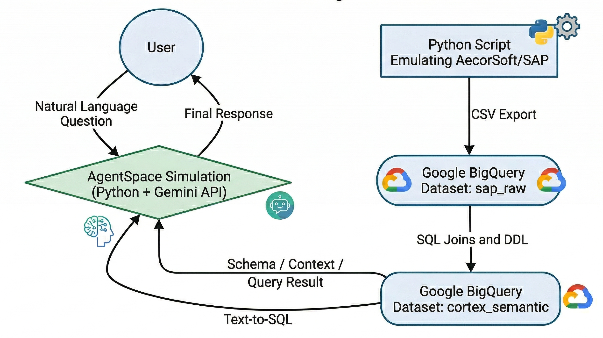

# SAP GCP Cortex Simulator

_Prueba de concepto (PoC) que simula el flujo de extracción de datos transaccionales (SAP S/4HANA), su modelado semántico en Google BigQuery inspirado en Cortex Framework, y su consumo mediante un Agente Conversacional usando la API de Gemini._

[Read in English](README.md)

## Executive Summary
Este proyecto es una simulación de un flujo de integración de datos empresarial. Utiliza Python para emular la extracción de herramientas de ingesta de terceros (como AecorSoft), BigQuery para emular la capa fundacional de Cortex, y la API de Gemini para emular una interfaz conversacional inteligente (como AgentSpace).

Debido a que no contamos con datos crudos de referencia reales, el proyecto está diseñado de forma modular y flexible para poder adaptarse a cualquier tipo de datos si en un futuro es necesario.

## Arquitectura del Proyecto



1. **Extraction Mock:** Extracción sintética desde "SAP".
2. **Cortex Semantic Layer:** Almacenaje Raw y transformación a Modelos de Negocio en BigQuery.
3. **AgentSpace Mock:** Agente Conversacional Text-to-SQL.

## Tecnologías Utilizadas (Tech Stack)
* **Python:** Para simulación de extracción de datos y orquestación del agente conversacional.
* **Google BigQuery:** Como Data Warehouse para las capas Raw y Semántica.
* **SQL:** Transformación y despliegue del conocimiento de negocio.
* **Gemini API:** Modelo fundacional (LLM) que interpreta las preguntas.

## Paso a Paso (How it works)
* **Fase 1:** Generación sintética de tablas vbak y vbap usando Python, exportándolas como CSV (`src/01_extraction_mock/generate_sap_data.py`).
* **Fase 2:** Carga y transformación en BigQuery mediante consultas DDL para vistas de negocio (`src/02_cortex_semantic`).
* **Fase 3:** Consulta dinámica en lenguaje natural (GenAI) mediante un agente en consola (`src/03_agentspace_mock`).

## Instrucciones de Ejecución (How to run)

1. **Clonar proyecto e instalar dependencias:**
   ```bash
   git clone <URL_DEL_REPOSITORIO>
   cd sap-gcp-cortex-simulator
   pip install -r requirements.txt
   ```
2. **Generar Datos Falsos:**
   ```bash
   python src/01_extraction_mock/generate_sap_data.py
   ```
   *Esto generará archivos `.csv` en la carpeta `data_mock/`.*

3. **Cargar los datos a BigQuery:**
   * Crear proyecto gratuito en Google Cloud.
   * Ejecutar los scripts ubicados en `src/02_cortex_semantic/`.
   
4. **Ejecutar el Agente Conversacional:**
   * Crear archivo `.env` y configurar `GEMINI_API_KEY=tu_clave_aqui` e idealmente tus credenciales de GCP.
   ```bash
   python src/03_agentspace_mock/data_agent.py
   ```
